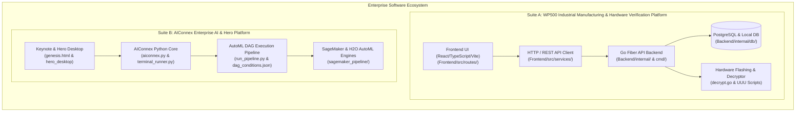

# 🏛️ Executive Master System Navigation & Architecture Map

> **Prepared for Senior Leadership & Engineering Teams**  
> *This document provides a single, unambiguous lookup catalog mapping every feature, frontend page, UI component, backend service, database script, and hardware test tool across your enterprise software ecosystem.*

---

## 🌟 Executive System Architecture Overview



---

## 📁 1. Suite A: WP500 Industrial Hardware Test Platform (`WP500_TEST_SUITE_v2`)

Located at: `c:\Users\admin.DESKTOP-17T37DJ\Desktop\WP500_TEST_SUITE_v2\`

### 🖥️ Frontend Pages & UI Components Lookup Matrix

| Feature / Module Name | Page Purpose / Functionality | Exact Frontend Route File Path | Key UI Components | Backend API Service | DB Entity / Migrations |
| :--- | :--- | :--- | :--- | :--- | :--- |
| **Hardware Verification** | Peripheral, voltage, & resistance validation | [hardware-verification.peripheral.tsx](file:///c:/Users/admin.DESKTOP-17T37DJ/Desktop/WP500_TEST_SUITE_v2/WP500_TEST_SUITE/Frontend/src/routes/hardware-verification.peripheral.tsx)<br>[hardware-verification.voltage.tsx](file:///c:/Users/admin.DESKTOP-17T37DJ/Desktop/WP500_TEST_SUITE_v2/WP500_TEST_SUITE/Frontend/src/routes/hardware-verification.voltage.tsx)<br>[hardware-verification.resistance.tsx](file:///c:/Users/admin.DESKTOP-17T37DJ/Desktop/WP500_TEST_SUITE_v2/WP500_TEST_SUITE/Frontend/src/routes/hardware-verification.resistance.tsx) | `components/process/`<br>`hardwareVerificationApi.ts` | Go Fiber API<br>`/api/v1/hardware-verification` | `internal/db/migrations.go`<br>Tables: `hardware_tests` |
| **Functional Testing Stage 1** | Primary PCB functional verification & diagnostics | [functional-testing-1.tsx](file:///c:/Users/admin.DESKTOP-17T37DJ/Desktop/WP500_TEST_SUITE_v2/WP500_TEST_SUITE/Frontend/src/routes/functional-testing-1.tsx) | `components/process/StepTimer`<br>`components/process/StatusCard` | `/api/v1/functional-testing/1` | `internal/db/migrations.go`<br>Tables: `test_execution_logs` |
| **Functional Testing Stage 2** | Secondary integration & load verification | [functional-testing-2.tsx](file:///c:/Users/admin.DESKTOP-17T37DJ/Desktop/WP500_TEST_SUITE_v2/WP500_TEST_SUITE/Frontend/src/routes/functional-testing-2.tsx) | `components/process/DiagnosticPanel`<br>`components/common/Badge` | `/api/v1/functional-testing/2` | `internal/db/migrations.go`<br>Tables: `test_execution_logs` |
| **Firmware Provisioning** | Flashing encrypted UUU binaries & verification | [firmware.tsx](file:///c:/Users/admin.DESKTOP-17T37DJ/Desktop/WP500_TEST_SUITE_v2/WP500_TEST_SUITE/Frontend/src/routes/firmware.tsx) | `components/process/FirmwareFlashingModal`<br>`components/common/ProgressBar` | `/api/v1/firmware/flash`<br>[decrypt.go](file:///c:/Users/admin.DESKTOP-17T37DJ/Desktop/WP500_TEST_SUITE_v2/decrypt.go) | `internal/db/migrations.go`<br>Tables: `firmware_versions` |
| **PCB Board Receipt** | Inwarding raw PCBs, barcode scanning & MAC pool | [board-receipt.tsx](file:///c:/Users/admin.DESKTOP-17T37DJ/Desktop/WP500_TEST_SUITE_v2/WP500_TEST_SUITE/Frontend/src/routes/board-receipt.tsx) | `components/traceability/BarcodeScanner`<br>`components/master/BoardTypeSelect` | `/api/v1/boards/receipt` | `internal/db/migrations.go`<br>Tables: `boards`, `mac_pool` |
| **Final Box Build Assembly** | Mechanical enclosure assembly & unit pairing | [box-build.tsx](file:///c:/Users/admin.DESKTOP-17T37DJ/Desktop/WP500_TEST_SUITE_v2/WP500_TEST_SUITE/Frontend/src/routes/box-build.tsx) | `components/process/EnclosurePairing`<br>`components/common/DataTable` | `/api/v1/box-build` | `internal/db/migrations.go`<br>Tables: `units`, `enclosures` |
| **Final QA Inspection** | End-of-line quality signoff & serial locking | [final-qa.tsx](file:///c:/Users/admin.DESKTOP-17T37DJ/Desktop/WP500_TEST_SUITE_v2/WP500_TEST_SUITE/Frontend/src/routes/final-qa.tsx) | `components/process/DefectCodeSelector`<br>`components/reports/SignoffForm` | `/api/v1/qa/signoff` | `internal/db/migrations.go`<br>Tables: `qa_inspections` |
| **Reports & Analytics** | QA Compliance, Pass/Fail trends & PDF exports | [reports.tsx](file:///c:/Users/admin.DESKTOP-17T37DJ/Desktop/WP500_TEST_SUITE_v2/WP500_TEST_SUITE/Frontend/src/routes/reports.tsx) | `components/reports/ReportViewer`<br>`components/reports/ExportPdfModal` | [service.go](file:///c:/Users/admin.DESKTOP-17T37DJ/Desktop/WP500_TEST_SUITE_v2/WP500_TEST_SUITE/Backend/internal/reports/service.go) | `internal/db/migrations.go`<br>Tables: `reports` |
| **Unit Traceability** | Complete component genealogy & barcode tracking | [traceability.tsx](file:///c:/Users/admin.DESKTOP-17T37DJ/Desktop/WP500_TEST_SUITE_v2/WP500_TEST_SUITE/Frontend/src/routes/traceability.tsx) | `components/traceability/GenealogyTree`<br>`components/traceability/HistoryTimeline` | `/api/v1/traceability/:serial` | `internal/db/migrations.go`<br>Tables: `unit_traceability` |
| **Admin & Master Data** | Workstations, Operators, Defect codes, Settings | [admin.system-settings.tsx](file:///c:/Users/admin.DESKTOP-17T37DJ/Desktop/WP500_TEST_SUITE_v2/WP500_TEST_SUITE/Frontend/src/routes/admin.system-settings.tsx)<br>`admin.master-data.*.tsx` | `components/master/*`<br>`components/layout/Sidebar` | `/api/v1/admin/*` | [generate_postgres_ddl.py](file:///c:/Users/admin.DESKTOP-17T37DJ/Desktop/WP500_TEST_SUITE_v2/WP500_TEST_SUITE/Backend/generate_postgres_ddl.py) |

---

### ⚡ Backend Services & Hardware Scripts

1. **Go Reports Service**: [service.go](file:///c:/Users/admin.DESKTOP-17T37DJ/Desktop/WP500_TEST_SUITE_v2/WP500_TEST_SUITE/Backend/internal/reports/service.go)
   - Generates compliance reports, PDF exports, and historical pass/fail metrics.
2. **Database Migrations Engine**: [migrations.go](file:///c:/Users/admin.DESKTOP-17T37DJ/Desktop/WP500_TEST_SUITE_v2/WP500_TEST_SUITE/Backend/internal/db/migrations.go)
   - Handles auto-migrations and schema evolution for PostgreSQL & SQLite local instances.
3. **PostgreSQL Schema DDL Generator**: [generate_postgres_ddl.py](file:///c:/Users/admin.DESKTOP-17T37DJ/Desktop/WP500_TEST_SUITE_v2/WP500_TEST_SUITE/Backend/generate_postgres_ddl.py)
   - Python utility script to export and sync DDL schema files for enterprise PostgreSQL deployment.
4. **Secure UUU Decryptor CLI**: [decrypt.go](file:///c:/Users/admin.DESKTOP-17T37DJ/Desktop/WP500_TEST_SUITE_v2/decrypt.go)
   - AES-256 GCM cryptographic decryptor for flashing binary artifacts onto NXP hardware boards via `.auto` / `.uuu` scripts.

---

## 🚀 2. Suite B: AIConnex Enterprise AI & AutoML Hero Platform (`stitch_aiconnex_enterprise_hero_design`)

Located at: `c:\Users\admin.DESKTOP-17T37DJ\Downloads\stitch_aiconnex_enterprise_hero_design\`

### 🤖 UI Applications & Keynote Presentation Suite

| Module / Feature Name | Functionality & Target Audience | Source File Path | Technology Stack |
| :--- | :--- | :--- | :--- |
| **Genesis Keynote Suite** | Interactive Executive Keynote & Product Demo | [genesis.html](file:///c:/Users/admin.DESKTOP-17T37DJ/Downloads/stitch_aiconnex_enterprise_hero_design/aiconnex_hero_keynote_suite/genesis.html)<br>`genesis.js`, `genesis.css` | HTML5, CSS3, Canvas Motion, Web Audio Synthesizer |
| **Product Presentation App** | Live product feature animation & showcase | `aiconnex_hero_keynote_suite/index.html`<br>`app.js`, `styles.css` | Vanilla JavaScript, Dynamic Animations |
| **Hero Desktop Environment** | Enterprise AI workspace desktop UI | `stitch_aiconnex_enterprise_hero_design/aiconnex_hero_desktop` | Node.js Express server (`server.js`) |
| **Industrial AutoML UI** | Visual AutoML model training dashboard | `stitch_aiconnex_enterprise_hero_design/industrial_automl_intelligence` | Web UI & WebSocket live stream |
| **AI Assistant Chat UI** | Multi-agent interactive chat interface | `stitch_aiconnex_enterprise_hero_design/aiconnex_hero_chat_open` | Web Chat UI & Agent API Integration |

---

### ⚙️ Core AI & AutoML Backend Services

| Service / Tool Name | Purpose | File Path | Tech Stack |
| :--- | :--- | :--- | :--- |
| **AIConnex Assistant Core** | Core intelligence & agent execution handler | [aiconnex.py](file:///c:/Users/admin.DESKTOP-17T37DJ/Downloads/stitch_aiconnex_enterprise_hero_design/aiconnex_demo/aiconnex.py) | Python 3, LangChain/LangGraph |
| **AutoML DAG Pipeline** | End-to-End automated machine learning pipeline | [run_pipeline.py](file:///c:/Users/admin.DESKTOP-17T37DJ/Downloads/stitch_aiconnex_enterprise_hero_design/aiconnex_demo/run_pipeline.py) | Python, H2O AutoML, Pandas, Scikit-learn |
| **Terminal Runner** | Interactive command execution & pipeline orchestration | [terminal_runner.py](file:///c:/Users/admin.DESKTOP-17T37DJ/Downloads/stitch_aiconnex_enterprise_hero_design/aiconnex_demo/terminal_runner.py) | Python Subprocess & Async Runner |
| **SageMaker ML Pipeline** | Cloud model training & deployment pipeline | `aiconnex_demo/sagemaker_pipeline/` | AWS Boto3 & SageMaker SDK |
| **DAG Conditions Mapping** | Execution logic schema for pipeline nodes | `aiconnex_demo/dag_conditions_mapping.json` | JSON Schema Specification |

---

## 🎯 Quick-Reference Cheat Sheet for Executive Demonstrations

### 1. Launching WP500 Manufacturing Suite
```powershell
# Launch Backend Server (Port 8080)
cd "c:\Users\admin.DESKTOP-17T37DJ\Desktop\WP500_TEST_SUITE_v2\WP500_TEST_SUITE"
.\run-backend.ps1

# Launch Frontend UI (Port 5173 / SPA)
cd "c:\Users\admin.DESKTOP-17T37DJ\Desktop\WP500_TEST_SUITE_v2\WP500_TEST_SUITE\Frontend"
npm run dev
```

### 2. Launching AIConnex Genesis Keynote Suite
```powershell
cd "c:\Users\admin.DESKTOP-17T37DJ\Downloads\stitch_aiconnex_enterprise_hero_design\aiconnex_hero_keynote_suite"
node server-genesis.js
# Open http://localhost:3001 in browser
```

---

*This guide fully eliminates ambiguity across folders, frontends, backends, pages, components, and hardware tools.*
