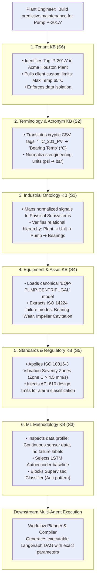

# Project Snapshot — AIConnex Industrial AI Platform

**Version:** v8.0  
**Last Updated:** 2026-08-15  
**Core Architecture:** 3-Studio Architecture (Data-Studio, ML-Studio, Agent-Studio) + 6-KB Platform Knowledge Base + 22-Node LangGraph Brain + 9-Node Microservice Cascade.

---

## 🧠 Platform Knowledge Base (S1–S6) Multi-Agent Execution Chain



---

## 📋 6-KB Responsibility & Downstream Agent Consumer Matrix

| Knowledge Base | Exact Function | If It Were Missing... | Downstream Agent Consumer |
|---|---|---|---|
| **S1 — Industrial Ontology** | Defines the structural hierarchy *(Plant ➔ Unit ➔ Asset ➔ Subsystem ➔ Sensor)* | The system wouldn't know which sensor belongs to which physical component. | **PreUploadAgent & ScoutAgent** (validates dataset structure) |
| **S2 — Terminology & Synonyms** | Decodes 600+ industrial abbreviations *(PV, SP, MV, DE, NDE, RMS, RUL, MTBF)* and unit conversions | CSV headers like `PMP_DE_VIB` would be treated as meaningless gibberish. | **Semantic Extractor** (normalizes columns) |
| **S3 — ML Methodology** | Dictates model compatibility, required sample sizes, metric selection, and anti-patterns | The agent would hallucinate random ML models (e.g. attempting supervised classification on unlabelled data). | **Workflow Planner & Selector Agent** (picks correct algorithms) |
| **S4 — Equipment & Assets** | Stores physics models for Pumps, Compressors, Valves, and exact **ISO 14224 failure modes** | Anomaly scores wouldn't map to real physical failure mechanisms (e.g. cavitation vs bearing fatigue). | **Feature Analyzer & Recipe Catalog** (generates FFT / domain features) |
| **S5 — Standards & Regulatory** | Contains ISO 10816 vibration zones, API 610, ISO 13374 diagnostics, OSHA limits | The AI wouldn't know if a 4.5 mm/s vibration reading is a safe normal state or a catastrophic trip. | **Plan Evaluator & Judge Agent** (validates compliance thresholds) |
| **S6 — Tenant Knowledge** | Stores client plants, serial numbers, custom machine tags (`P-201A`), and client operating overrides | The AI would treat every plant the same and leak proprietary data across customers. | **ContextBuilder & Security Layer** (scopes runtime to client) |

---

## ⚡ Unified Access: `ContextBuilder.get_context()`

Agents invoke [`ContextBuilder.get_context()`](file:///x:/TAS/AICONNEX/aiconnex_agent/platform_kb/context_builder.py) once to receive a deterministic **`EvidencePack`**:

```python
context = context_builder.get_context(
    ContextRequest(
        query="Build vibration anomaly detection pipeline for P-201A",
        tenant_id="TENANT-DEMO-ACME",
        project_id="PROJ-ACME-HOUSTON"
    )
)
```
