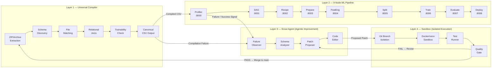
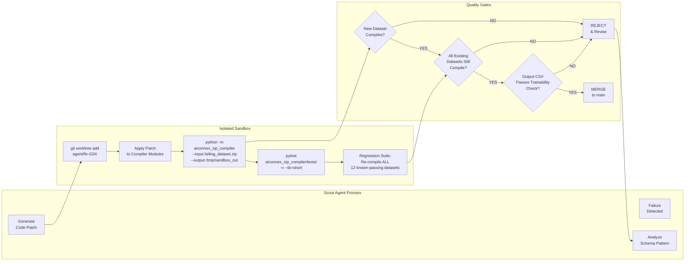
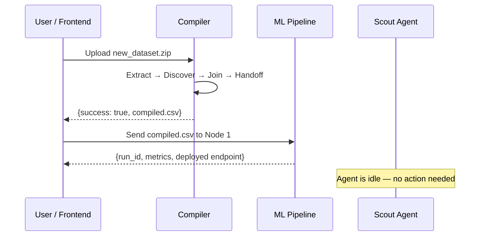
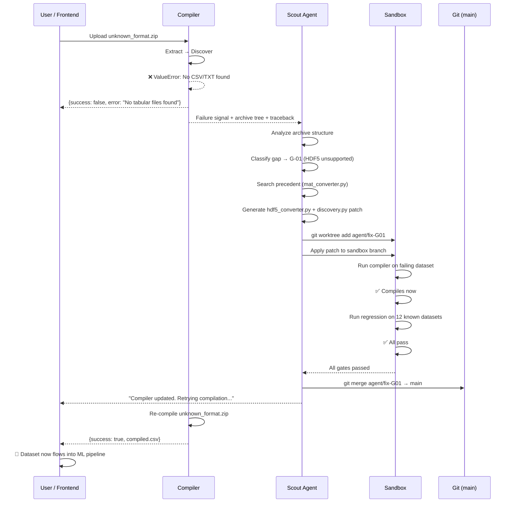
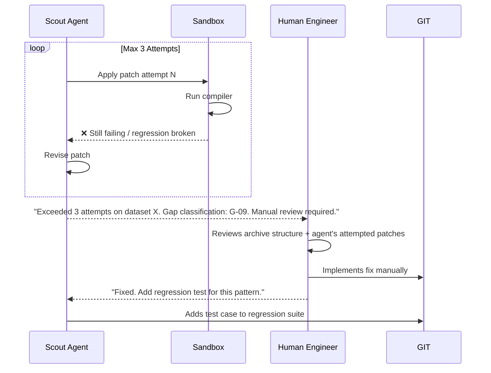
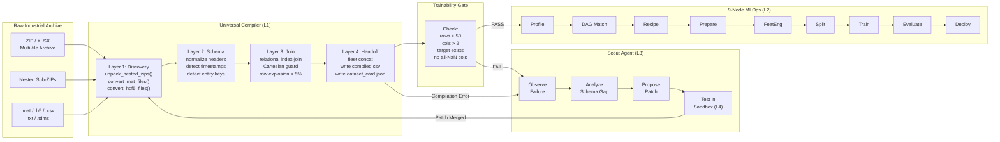

# AIConnex Scout Agent — Self-Improving Compiler Architecture

> **Document Type:** Architecture Specification & Planning Document  
> **Status:** PLANNING — No implementation until explicitly approved  
> **Date:** 2026-07-23 | **Author:** Backend Architecture Team

---

## Table of Contents

1. [Problem Statement](#1-problem-statement)
2. [System Architecture — 4 Layers](#2-system-architecture--4-layers)
3. [Current Compiler Capabilities & Gaps](#3-current-compiler-capabilities--gaps)
4. [Dataset Compatibility Matrix](#4-dataset-compatibility-matrix)
5. [Scout Agent — Agentic Improvement Loop](#5-scout-agent--agentic-improvement-loop)
6. [Sandbox Execution Architecture](#6-sandbox-execution-architecture)
7. [Quality Gates & Merge Protocol](#7-quality-gates--merge-protocol)
8. [Sequence Diagrams](#8-sequence-diagrams)
9. [Data Flow — Compiler to Pipeline](#9-data-flow--compiler-to-pipeline)
10. [Engineering Roadmap](#10-engineering-roadmap)

---

## 1. Problem Statement

Industrial datasets arrive in **arbitrary archive structures**. The same domain (prognostics, SCADA, power generation) can be packaged in wildly different ways:

| Dataset | Archive Structure | File Format | Schema Pattern |
| :--- | :--- | :--- | :--- |
| NASA C-MAPSS | Flat ZIP → 4 headerless `.txt` files | Space-delimited, no column names | 26-column turbofan sensor matrix |
| NASA Battery | ZIP → 6 nested sub-ZIPs → `.mat` structs | MATLAB struct arrays with cycle-based nesting | Battery voltage/current/temp per discharge cycle |
| FEMTO Bearing | Flat folder → 2,803 `acc_XXXXX.csv` snapshots | 2,560-row vibration waveforms per snapshot | 20kHz accelerometer, horizontal + vertical |
| NASA IMS Bearing | Flat folder → 7,588 headerless `.csv` files | 20kHz 4-channel vibration | No column names, no timestamps |
| Solar Power | ZIP → 2 CSVs with `PLANT_ID` entity key | Standard CSV with headers | Multi-plant relational (Plant 1, Plant 2) |
| IGBT Aging | ZIP → 200+ nested sub-ZIPs → `.mat` files | MATLAB struct + SMU characterization data | Deeply nested device-part-measurement hierarchy |
| Algae Raceway | ZIP → flat CSV files | Standard CSV | Multi-raceway environmental sensors |
| SCADA Trend | Single `.xlsx` with 10 metadata header rows | Excel with non-standard headers | Timestamp + 26 sensor columns |

**No single hardcoded compiler can handle every possible permutation.** The PNC (Possible Nested Combinations) of file handling is effectively unbounded. This is why we need an agent that **observes new failure patterns** and **evolves the compiler** over time.

---

## 2. System Architecture — 4 Layers



### Layer Responsibilities

| Layer | Role | Key Principle |
| :--- | :--- | :--- |
| **L1 — Compiler** | Deterministic ingestion. Extract, discover, join, validate, output clean CSV. | **Auditable & reproducible** — no LLM in the hot path |
| **L2 — ML Pipeline** | Profiling → DAG routing → Recipe → Prepare → FeatEng → Split → Train → Evaluate → Deploy | **Already built** — 9 microservices on ports 8000–8008 |
| **L3 — Scout Agent** | Observe failures, analyze schema gaps, propose code patches to L1 | **Improves the compiler, does not replace it** |
| **L4 — Sandbox** | Execute agent-proposed patches in isolation, run regression tests, gate before merge | **Never touches production code directly** |

> [!IMPORTANT]
> **The agent does NOT replace the compiler.** The agent improves the compiler. The compiler remains deterministic and auditable. The agent is a developer-assistant that proposes, tests, and submits patches — like a junior engineer with a code review gate.

---

## 3. Current Compiler Capabilities & Gaps

### ✅ What the Compiler Can Handle Today

| Capability | Module | Status |
| :--- | :--- | :---: |
| ZIP archive extraction (flat) | `discovery.py` | ✅ |
| Nested ZIP unpacking (recursive) | `discovery.py:unpack_nested_zips()` | ✅ |
| MATLAB `.mat` struct → CSV conversion | `mat_converter.py` | ✅ |
| Headerless space-delimited `.txt` (C-MAPSS pattern) | `discovery.py:safe_read_csv()` | ✅ |
| Multi-encoding fallback (`utf-8`, `latin-1`, `utf-8-sig`) | `discovery.py:safe_read_csv()` | ✅ |
| Multi-separator detection (`,`, `\t`, `;`, whitespace) | `discovery.py:safe_read_csv()` | ✅ |
| Timestamp column auto-detection (regex heuristic) | `discovery.py:profile_file()` | ✅ |
| Entity/group column auto-detection | `discovery.py:profile_file()` | ✅ |
| Fact vs Dimension table classification | `discovery.py:profile_file()` | ✅ |
| Group ID inference from filename patterns | `discovery.py:extract_group_id_from_filename()` | ✅ |
| Relational index-join with Cartesian guard | `relational_joiner.py` | ✅ |
| Schema normalization (snake_case, timestamp alignment) | `schema_mapper.py` | ✅ |
| High-frequency snapshot aggregation (vibration → features) | `snapshot_aggregator.py` | ✅ |
| Handoff export (per-group CSVs + combined CSV + audit JSON) | `handoff.py` | ✅ |
| Column header → `col_0..col_N` fallback for headerless files | `discovery.py:safe_read_csv()` | ✅ |
| 26-column C-MAPSS pattern → named columns | `discovery.py:safe_read_csv()` | ✅ |

### 🔴 Known Gaps — What the Compiler Cannot Handle Yet

| Gap ID | Description | Example Dataset That Exposes It | Severity |
| :---: | :--- | :--- | :---: |
| **G-01** | **HDF5 / `.h5` file ingestion** | IGBT aging SMU data (some datasets store in HDF5) | 🔴 High |
| **G-02** | **Parquet / Arrow file ingestion** | Modern cloud-exported telemetry dumps | 🟡 Medium |
| **G-03** | **Non-cycle MATLAB struct shapes** | MATLAB files where keys aren't `cycle`-based (e.g., vibration mode shapes) | 🔴 High |
| **G-04** | **TDMS file ingestion** (National Instruments) | NI DAQ/LabVIEW measurement files common in industrial test rigs | 🟡 Medium |
| **G-05** | **Excel multi-sheet extraction** | SCADA Trend_data.xlsx had 10 metadata header rows that needed manual skip | 🔴 High |
| **G-06** | **Automatic RUL/target synthesis** | Battery dataset needed manual `RUL = N_total - i` derivation | 🟡 Medium |
| **G-07** | **Cross-archive entity resolution** | Matching `train_FD001.txt` to `RUL_FD001.txt` by entity alignment | 🟡 Medium |
| **G-08** | **Sampling rate normalization** | IMS at 20kHz vs SCADA at 10-min intervals — no resampling logic | 🟡 Medium |
| **G-09** | **Deeply nested folder hierarchies** (>3 levels) | IGBT: `ZIP → sub-ZIP → device → part → measurement_type → .mat` | 🔴 High |
| **G-10** | **Trainability pre-check before handoff** | Currently emits CSV without checking if ML pipeline can actually process it | 🟡 Medium |
| **G-11** | **Image / binary sensor data** | Some prognostic datasets include thermal images or waveform plots | 🔲 Future |
| **G-12** | **Contextual README/metadata parsing** | Readme.pdf inside archives describes column semantics — currently ignored | 🔲 Future |

---

## 4. Dataset Compatibility Matrix

### NASA Prognostic Data Repository — All 21 Datasets

> [!NOTE]
> We have tested **6 of 21** NASA Prognostic datasets. The remaining 15 represent the next frontier for compiler evolution via the Scout Agent.

| # | Dataset Name | Archive Format | Tested? | Compiler Result | Key Schema Challenge |
| :---: | :--- | :--- | :---: | :--- | :--- |
| 1 | **C-MAPSS Turbofan** | ZIP → 4 `.txt` | ✅ **YES** | Compiled in 4.77s, pipeline $R^2=0.71$ | Headerless space-delimited, 26 cols |
| 2 | **Li-ion Battery** | ZIP → 6 sub-ZIPs → `.mat` | ✅ **YES** | Compiled via `mat_converter`, $R^2=0.99$ | Nested ZIPs + MATLAB struct arrays |
| 3 | **FEMTO Bearing** | Folder → 2,803 snapshots | ✅ **YES** | Compiled via `snapshot_aggregator` | 20kHz waveform aggregation |
| 4 | **IMS Bearing** | Folder → 7,588 snapshots | ✅ **YES** | Compiled, pipeline $R^2=0.77$ | Headerless 4-channel vibration |
| 5 | **IGBT Aging** | ZIP → nested sub-ZIPs → `.mat` | ✅ **YES** | Compiled via `mat_converter` | 200+ deeply nested `.mat` files |
| 6 | **Algae Raceway** | ZIP → flat CSVs | ✅ **YES** | Compiled directly | Standard CSV structure |
| 7 | Milling Dataset | Folder → MATLAB `.mat` | 🟡 Partial | `.mat` extraction works, domain features untested | Tool wear + cutting force structs |
| 8 | HIRF (MOSFET) | ZIP → nested `.mat` | 🔲 Not tested | — | Power MOSFET degradation structs |
| 9 | Capacitor Electrical Stress | Unknown | 🔲 Not tested | — | Unknown file structure |
| 10 | CFRP Composite | Unknown | 🔲 Not tested | — | Possibly ultrasonic scan images |
| 11 | Randomized Battery Usage | ZIP → `.mat` | 🔲 Not tested | — | Similar to #2 but randomized protocols |
| 12 | Turbofan New (N-CMAPSS) | ZIP → HDF5 `.h5` | 🔲 Not tested | — | **HDF5 format — Gap G-01** |
| 13 | Bearing (XJTU-SY) | ZIP → CSV | 🔲 Not tested | — | Likely compatible |
| 14 | Anemometer | Unknown | 🔲 Not tested | — | Wind speed sensor data |
| 15 | PMU Synchrophasor | Unknown | 🔲 Not tested | — | Power grid phasor measurements |
| 16 | Solid Rocket Motor | Unknown | 🔲 Not tested | — | Combustion instability data |
| 17 | Laser Degradation | Unknown | 🔲 Not tested | — | Optical power decay curves |
| 18 | Strain Gauge | Unknown | 🔲 Not tested | — | Structural health monitoring |
| 19 | Electronics Thermal Cycling | Unknown | 🔲 Not tested | — | Solder joint fatigue |
| 20 | Power System Aging | Unknown | 🔲 Not tested | — | Transformer oil analysis |
| 21 | Fuel Cell Degradation | Unknown | 🔲 Not tested | — | Electrochemical impedance |

### Non-NASA Datasets Also Tested

| Dataset | Source | Tested? | Compiler Result |
| :--- | :--- | :---: | :--- |
| **Solar Power Generation** | Kaggle | ✅ YES | Multi-plant relational join |
| **Medical Insurance** | Kaggle | ✅ YES | Flat CSV — trivial |
| **House Prices** | Kaggle | ✅ YES | Flat CSV — trivial |
| **Manufacturing Process** | Kaggle | ✅ YES | Flat CSV |
| **Equipment Anomaly** | Synthetic | ✅ YES | Flat CSV |
| **SCADA Telemetry** | Industrial | ✅ YES | Excel with metadata headers (manual pre-clean) |
| **Compressor Trends** | Industrial | ✅ YES | Flat CSV |

---

## 5. Scout Agent — Agentic Improvement Loop

### Core Principle

> The Scout Agent is a **compiler developer**, not a compiler replacement. It watches for failures, analyzes the structural pattern that caused the failure, proposes a targeted code patch to `aiconnex_zip_compiler/`, tests the patch in isolation, and submits it for review.

### The Observe → Patch → Test → Merge Loop

```mermaid
graph LR
    subgraph OBSERVE["Phase 1 — Observe"]
        O1["New Dataset\nUploaded"]
        O2["Run Compiler\non Dataset"]
        O3{"Compilation\nSucceeded?"}
        O1 --> O2 --> O3
    end

    subgraph ANALYZE["Phase 2 — Analyze"]
        A1["Inspect\nError Traceback"]
        A2["Profile Archive\nStructure\n(tree, formats, sizes)"]
        A3["Classify\nFailure Pattern\n(G-01..G-12)"]
        A4["Search for\nSimilar Patterns\nin Known Schemas"]
    end

    subgraph PATCH["Phase 3 — Propose Patch"]
        P1["Generate\nCode Diff\nfor Compiler Module"]
        P2["Create\nRegression Test\nfor New Pattern"]
        P3["Write\nPatched File\nto Sandbox Branch"]
    end

    subgraph TEST["Phase 4 — Test in Sandbox"]
        T1["git checkout -b\nagent/fix-G0X"]
        T2["Run Patched\nCompiler on\nFailing Dataset"]
        T3["Run Regression\nTests on ALL\nPreviously Passing\nDatasets"]
        T4{"All Tests\nPass?"}
    end

    subgraph GATE["Phase 5 — Quality Gate"]
        G1["Auto-Merge\nto main"]
        G2["Revise\nPatch"]
        G3["Escalate\nto Human"]
    end

    O3 -- "YES → No action" --> DONE["✅ Dataset\nCompiled"]
    O3 -- "NO → Failure" --> A1

    A1 --> A2 --> A3 --> A4
    A4 --> P1 --> P2 --> P3
    P3 --> T1 --> T2 --> T3 --> T4

    T4 -- "YES" --> G1
    T4 -- "NO, fixable" --> G2
    T4 -- "NO, complex" --> G3
    G2 --> P1
```



### What the Agent Sees (Input Context)

For each new dataset, the Scout Agent receives:

```json
{
  "archive_path": "data/raw/12.+New+Turbofan+N-CMAPSS.zip",
  "archive_tree": {
    "N-CMAPSS/": {
      "DS01-005.h5": {"size_mb": 1200, "format": "hdf5"},
      "DS02-006.h5": {"size_mb": 980, "format": "hdf5"},
      "Readme.pdf": {"size_mb": 2}
    }
  },
  "compiler_error": {
    "traceback": "ValueError: No CSV or TXT files found inside ZIP archive",
    "failing_module": "discovery.py:run_discovery()",
    "line": 248
  },
  "gap_classification": "G-01 (HDF5 ingestion not supported)",
  "similar_known_patterns": [
    {"dataset": "Battery", "fix_applied": "Added mat_converter.py", "gap": "G-03"}
  ]
}
```

### What the Agent Produces (Output Patch)

```diff
# Proposed patch: aiconnex_zip_compiler/hdf5_converter.py [NEW]
+ """Converts HDF5 (.h5) datasets to tabular CSV for compiler ingestion."""
+ import h5py
+ import pandas as pd
+ from pathlib import Path
+ 
+ def convert_hdf5_to_csv(h5_path: Path) -> Optional[Path]:
+     with h5py.File(h5_path, 'r') as f:
+         # ... extraction logic
+         df.to_csv(csv_path, index=False)
+     return csv_path

# Proposed patch: aiconnex_zip_compiler/discovery.py
  def run_discovery(zip_path, temp_dir):
      ...
      unpack_nested_zips(temp_dir)
      convert_mat_files(temp_dir)
+     convert_hdf5_files(temp_dir)  # NEW: Handle .h5 files
      ...
```

---

## 6. Sandbox Execution Architecture



### Sandbox Rules

1. **Never edit files on `main` directly.** All agent patches go to `agent/fix-*` branches.
2. **Never run agent-proposed code on the host system.** Execute in a venv or Docker container.
3. **Every patch must include a regression test.** The test encodes the new schema pattern so future agents don't break it.
4. **The agent gets max 3 revision attempts per dataset.** After 3 failures → escalate to human.
5. **Every successful patch is logged to `compiler_evolution_log.json`** for audit trail.

---

## 7. Quality Gates & Merge Protocol

### Gate 1 — Compilation Success

```python
# The failing dataset must now compile successfully
result = UnifiedCompiler(zip_path=failing_dataset, output_dir=sandbox_out).compile()
assert result.success is True
assert result.combined_file is not None
assert os.path.getsize(result.combined_file) > 0
```

### Gate 2 — Regression (No Existing Datasets Break)

```python
# ALL previously passing datasets must still compile
REGRESSION_DATASETS = [
    "data/raw/NASA C-MAPSS-1 Turbofan Engine Degradation Dataset.zip",
    "data/raw/5.+Battery+Data+Set.zip",
    "data/raw/Solar Power Generation Data.zip",
    "data/raw/algae.zip",
    "data/raw/house-prices-advanced-regression-techniques.zip",
    "data/raw/medical_insurance.zip",
    # + FEMTO, IMS, IGBT (folder-based)
]

for ds in REGRESSION_DATASETS:
    result = UnifiedCompiler(zip_path=ds, output_dir=f"/tmp/regress_{hash}").compile()
    assert result.success is True, f"REGRESSION FAILURE on {ds}"
```

### Gate 3 — Trainability Check

```python
# The compiled CSV must be ingestible by Node 1 (Dataset Profiler)
import requests
resp = requests.post("http://127.0.0.1:8000/api/v1/profile",
    files={"file": open(result.combined_file, "rb")})
assert resp.status_code == 200
profile = resp.json()
assert profile["shape"][0] > 50    # Minimum rows
assert profile["shape"][1] > 2     # Minimum columns
```

### Gate 4 — Human Review (Optional Override)

For patches that modify core logic (not just adding a new converter), require human code review before merge.

---

## 8. Sequence Diagrams

### 8.1 Happy Path — New Dataset Compiles Successfully



### 8.2 Failure Path — Scout Agent Activates



### 8.3 Agent Failure — Escalation to Human



---

## 9. Data Flow — Compiler to Pipeline

### Complete Ingestion-to-Deployment Flow



---

## 10. Engineering Roadmap

### Phase 1 — Compiler Hardening (Pre-Agent)

> Before the Scout Agent can operate, the compiler itself needs a regression test suite and a structured failure reporting format.

| Task | Priority | Estimated Effort |
| :--- | :---: | :---: |
| Build `compiler_regression_suite.py` — automated test over all 12 known-passing datasets | 🔴 P0 | 4 hours |
| Add structured `CompilationFailureReport` dataclass with traceback, archive tree, gap classification | 🔴 P0 | 2 hours |
| Add HDF5 converter (`hdf5_converter.py`) for N-CMAPSS and modern telemetry | 🔴 P0 | 3 hours |
| Add Excel multi-sheet extraction with metadata-row skip heuristic | 🟡 P1 | 3 hours |
| Add trainability pre-check before handoff (row count, column count, NaN ratio) | 🟡 P1 | 2 hours |
| Add Parquet/Arrow ingestion support | 🟢 P2 | 2 hours |

### Phase 2 — Scout Agent Core

| Task | Priority | Estimated Effort |
| :--- | :---: | :---: |
| Build `ScoutAgent` class with observe/analyze/patch/test loop | 🔴 P0 | 8 hours |
| Implement archive tree profiler (scan ZIP contents before extraction) | 🔴 P0 | 3 hours |
| Implement gap classifier (maps failure traceback → G-01..G-12 codes) | 🟡 P1 | 4 hours |
| Implement patch generator using LLM as planner/editor | 🟡 P1 | 6 hours |
| Build sandbox runner with git worktree isolation | 🟡 P1 | 4 hours |

### Phase 3 — Continuous Evolution

| Task | Priority | Estimated Effort |
| :--- | :---: | :---: |
| Integrate remaining 15 NASA Prognostic datasets as test harness | 🔴 P0 | Ongoing |
| Build `compiler_evolution_log.json` audit trail | 🟡 P1 | 2 hours |
| Implement auto-merge for converter-only patches (low risk) | 🟡 P1 | 3 hours |
| Build UI dashboard for compiler evolution history | 🟢 P2 | 6 hours |
| Implement README/metadata PDF parsing for column semantic hints | 🟢 P2 | 4 hours |

---

### Summary of Design Principles

1. **The compiler is deterministic.** No LLM in the hot path. The compiled output is auditable and reproducible.
2. **The agent is a developer, not an operator.** It writes code patches, not runtime decisions.
3. **Sandbox isolation is non-negotiable.** Agent code runs in git branches and isolated environments, never on production.
4. **Regression tests are mandatory.** Every agent patch must include a test that encodes the new pattern.
5. **Escalation is built in.** After 3 failed attempts, the agent stops and asks a human.
6. **The platform evolves as new formats appear.** Each new dataset makes the compiler permanently smarter.

---

> [!TIP]
> **Recommended next step:** Approve this architecture, then start with **Phase 1** — building the compiler regression test suite and structured failure reporter. This is the foundation the Scout Agent needs before it can operate.
